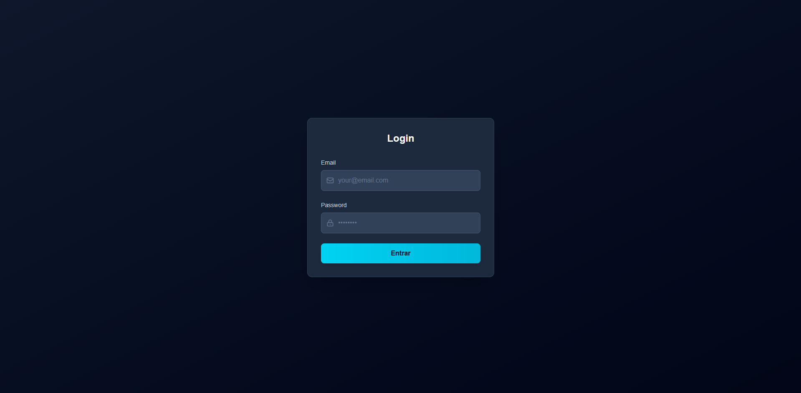
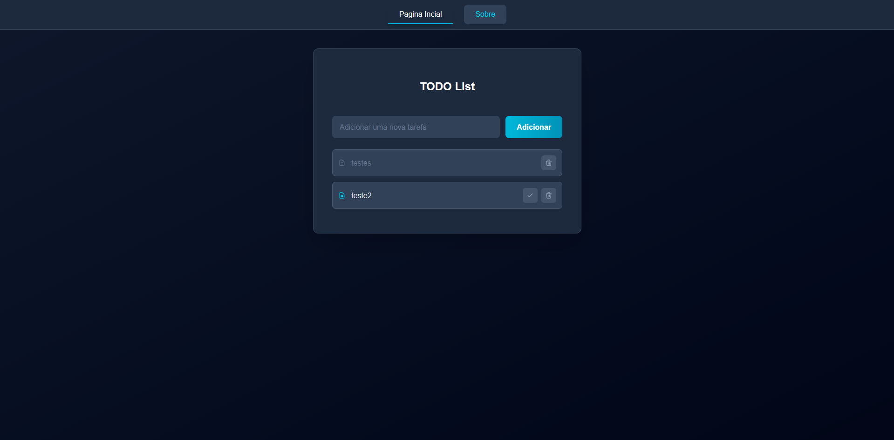
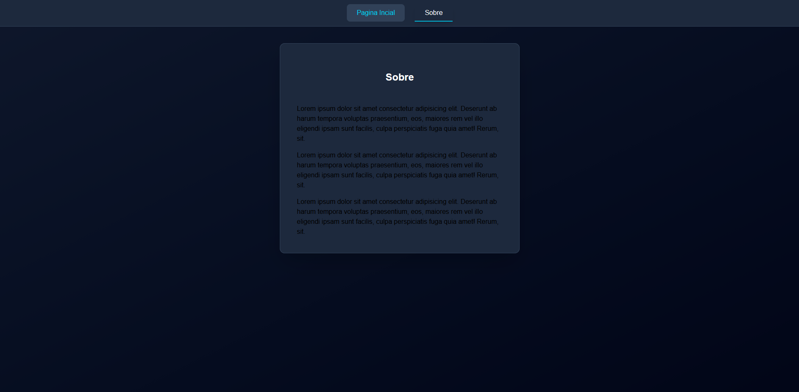

# 📝 TODO App (Simple)

A simple To-Do application that lets you manage tasks with basic functionality. It features a **visual login** screen, **task management**, and **localStorage persistence**—no database required!

## 🚀 Features

- **🔐 Visual Login**: Users are redirected to the main task page after logging in (no backend authentication).
- **➕ Add Tasks**: Easily add new tasks to your to-do list.
- **❌ Delete Tasks**: Remove tasks you no longer need.
- **✅ Mark as Done**: Mark tasks as completed when done.
- **💾 Persistence**: Tasks are saved in the browser's `localStorage`, so they persist even after refreshing the page.

## 📸 Screenshots

Here are some screenshots of the application:

1. **Login Page**  
   

2. **Main Task Page**  
   

3. **About Page**  
   

## 💡 Usage

1. **Login**: Enter any credentials on the login page (this is just a visual login for the UI).
2. **Add Tasks**: Type your task in the input field and click the "Add Task" button.
3. **Mark as Done**: Click the checkbox to mark a task as completed.
4. **Delete Tasks**: Click the trash can icon next to a task to remove it from your list.

## 🔧 Technologies Used

- **React**: For building the user interface.
- **Vite**: Next-generation build tool for faster development.
- **TypeScript**: Adding static typing for better code quality and maintainability.
- **TailwindCSS**: Utility-first CSS framework for rapid UI development.
